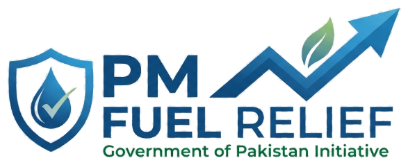

<div align="center">

  

  # PM Fuel Relief 2026
  ### Official 9771 SMS Syntax Generator & Public Guideline Portal
  *(وزیر اعظم پیٹرول ریلیف میسج جنریٹر 2026 / پيٽرول رليف ايس ايم ايس جنريٽر)*

  <p align="center">
    An independent, accessible, and privacy-first web utility built to empower Pakistani citizens—especially daily wage earners, motorcyclists, rickshaw drivers, and small car owners—to easily format, validate, and send error-free SMS messages for the <strong>9771 PM Fuel Relief Scheme 2026</strong>.
  </p>

  <p align="center">
    <a href="https://pmfuelreliefsmsgenerator.vercel.app/"></a>
    <a href="https://github.com/soorajhamirani/PM-Fuel-Relief-SMS-Generator"></a>
    
    
    
    
  </p>

</div>

---

## 📋 Table of Contents

- [Overview](#-overview)
- [Key Features](#-key-features)
- [Official 9771 SMS Syntax Matrix](#-official-9771-sms-syntax-matrix)
- [Scheme Subsidy & Quota Breakdown](#-scheme-subsidy--quota-breakdown)
- [Province Codes Directory](#-province-codes-directory)
- [User Experience & Accessibility](#-user-experience--accessibility)
- [Tech Stack & Architecture](#-tech-stack--architecture)
- [Project Directory Structure](#-project-directory-structure)
- [Getting Started](#-getting-started)
- [SEO & Open Graph Optimization](#-seo--open-graph-optimization)
- [Privacy & Ethical Disclaimer](#-privacy--ethical-disclaimer)
- [Author & Credits](#-author--credits)

---

## 📌 Overview

The **Government of Pakistan's PM Fuel Relief Scheme (9771)** provides an essential **Rs. 100 per liter discount** on petrol for low-income citizens operating motorcycles, rickshaws, or vehicles up to 800cc. However, thousands of applicants fail to qualify or experience delays simply due to syntax errors in SMS formatting (such as misplaced hashes `#`, incorrect date structures, or invalid province abbreviations).

**PM Fuel Relief 2026 (`fuelrelief`)** resolves this digital divide. It provides an intuitive, zero-barrier client-side tool with instant validation, interactive visual previews, voice narration, and 1-click SMS dispatch.

---

## ✨ Key Features

### 🌐 1. Multilingual & Seamless Bi-Directional Layout
- **English (Default LTR)**: Clean, high-readability international layout.
- **اردو (Urdu RTL)**: Embedded with *Noto Nastaliq Urdu* and *Gulzar* typography for intuitive comprehension.
- **سنڌي (Sindhi RTL)**: Formatted with native *Noto Sans Arabic* script for Sindhi-speaking citizens.
- **Top-Right Pinned Language Switcher**: Rock-solid, fixed top-right dropdown with high z-index that maintains position across all language and RTL/LTR shifts.

### 🛡️ 2. Strict Real-World 9771 SMS Syntax
- **Space-Separated Format**: Fully compliant with telecommunication gateway specifications (`REG [CNIC] [VEHICLE] [PROVINCE] [DDMMYYYY]`). Strictly avoids breaking hash `#` symbols.
- **8-Digit Date Sanitization**: Automatically translates date selections into clean `DDMMYYYY` continuous strings.
- **2006+ Vehicle Year Validation**: Instant real-time alerts if a vehicle's registration date precedes 2006, explaining eligibility criteria before SMS dispatch.
- **Generic Safe Placeholders**: Protects user privacy with generalized samples (`ABC-1234`, `4210112345671`).

### 🎟️ 3. Fuel Token (TOK) Generator & Realistic 9771 Mock Reply Card
- **1-Click TOK Dispatch**: Instant shortcode generation for registered users requiring an active OTP token at filling stations.
- **Realistic Mock Chat Preview**: Renders an authentic replica of the official 9771 SMS reply card in Urdu:
  ```text
  آپ کا ٹوکن: 34701XXXXX ہے
  آپ کی سواری کا نمبر: ABC-1234 ہے
  فیول: 5.00 لیٹر
  آپ کا ٹوکن 7 دن (17:19 24-Sep) تک قابل استعمال ہے
  ```
- **Validity & Quota Highlight**: Transparently clarifies that each issued token remains valid for **7 days** with a standard **5 Liters** per-fill allotment.

### 🔊 4. Web Speech Voice Narration (Accessibility First)
- Built-in text-to-speech assistant supporting English, Urdu, and Sindhi dialects.
- Enables low-literacy citizens and daily wage workers to listen to instructions aloud with a single tap.

### 📱 5. Instant 1-Click Mobile Dispatch & QR Code Scanner
- Deep-linked `sms:9771?body=...` integration automatically opens the device's native messaging application with pre-filled content.
- QR Code generation allows desktop users to instantly scan and send from their smartphones.
- Zero-cost reminder: SMS to 9771 operates **100% free of charge** (works with 0 PKR SIM balance).

### ⚖️ 6. Load-Time Transparency & Disclaimer Modal
- A clean, accessible modal dialog triggers on initial load and refresh to explicitly notify visitors that this utility is an independent public aid tool and **not an official government portal**.
- Zero data collection, storage, or external server tracking.

---

## 📲 Official 9771 SMS Syntax Matrix

| Operation | SMS Format Pattern | Realistic Example | Recipient |
| :--- | :--- | :--- | :---: |
| **New Registration** | `REG [CNIC] [VEHICLE_NO] [PROVINCE] [DDMMYYYY]` | `REG 4210112345671 ABC-1234 S 20052014` | **9771** |
| **Request Fuel Token** | `TOK` | `TOK` | **9771** |

> 💡 **Note**: Do **not** use hash (`#`) symbols or special characters. Space characters are strictly required between parameters.

---

## ⛽ Scheme Subsidy & Quota Breakdown

| Vehicle Category | Engine Capacity | Monthly Quota | Subsidy Benefit | Estimated Monthly Savings |
| :--- | :---: | :---: | :---: | :---: |
| **Motorcycle / Scooter** | Any | **20 Liters / Month** | **Rs. 100 / Litre** | **Rs. 2,000 / Month** |
| **Rickshaw (3-Wheeler)** | Any | **20 Liters / Month** | **Rs. 100 / Litre** | **Rs. 2,000 / Month** |
| **Small Car / Hatchback** | Up to **800cc** | **30 Liters / Month** | **Rs. 100 / Litre** | **Rs. 3,000 / Month** |

---

## 🗺️ Province Codes Directory

| Code | Province / Region | Urdu | Sindhi |
| :---: | :--- | :--- | :--- |
| **S** | Sindh | سندھ (S) | سنڌ (S) |
| **P** | Punjab | پنجاب (P) | پنجاب (P) |
| **K** | Khyber Pakhtunkhwa | خیبر پختونخوا (K) | خيبر پختونخواھ (K) |
| **B** | Balochistan | بلوچستان (B) | بلوچستان (B) |
| **I** | Islamabad Capital Territory | اسلام آباد (I) | اسلام آباد (I) |
| **A** | Azad Jammu & Kashmir | آزاد کشمیر (A) | آزاد ڪشمير (A) |
| **G** | Gilgit-Baltistan | گلگت بلتستان (G) | گلگت بلتستان (G) |

---

## 🛠️ Tech Stack & Architecture

- **Core Framework**: [React 18](https://react.dev/) + [TypeScript](https://www.typescriptlang.org/)
- **Bundler & Tooling**: [Vite](https://vitejs.dev/)
- **Styling & Design System**: [Tailwind CSS](https://tailwindcss.com/) with custom Pakistani Emerald Green (`#005826`) and Amber Relief palettes
- **Animation & Transitions**: [Framer Motion](https://www.framer.com/motion/)
- **Iconography**: [Lucide React](https://lucide.dev/)
- **QR Code Engine**: [qrcode.react](https://github.com/zpao/qrcode.react)
- **Delight Effects**: [canvas-confetti](https://www.npmjs.com/package/canvas-confetti)
- **Typography**: Google Fonts (*Inter*, *Noto Nastaliq Urdu*, *Noto Sans Arabic*, *Gulzar*)

---

## 📁 Project Directory Structure

```text
PM-Fuel-Relief-SMS-Generator/
├── public/
│   ├── fuel-logo.png             # 512x512 crisp shield favicon & app icon
│   ├── pm-fuel-relief-logo.png    # Official horizontal branding logo
│   ├── og-image.png               # 1200x630 social share Open Graph banner
│   ├── robots.txt                 # Search engine crawling rules
│   └── sitemap.xml                # Canonical XML sitemap
├── src/
│   ├── components/
│   │   ├── DisclaimerModal.tsx    # Privacy and non-governmental disclaimer modal
│   │   ├── Footer.tsx             # Developer credits & social profile links
│   │   ├── Header.tsx             # Header bar with official logo & voice assistant
│   │   ├── HeroSection.tsx        # Hero banner with scheme badges & highlights
│   │   ├── HowItWorks.tsx         # Comprehensive multi-step guideline tab
│   │   ├── LanguageSwitcher.tsx   # Fixed top-right LTR/RTL multilingual toggle
│   │   ├── RegistrationForm.tsx   # Registration form with 2006+ validation
│   │   ├── SmsPreviewCard.tsx     # Copy, QR, and Direct SMS dispatch card
│   │   ├── TabNav.tsx             # Smooth tab navigation controller
│   │   ├── Toast.tsx              # Dynamic feedback notifications
│   │   └── TokenRequestForm.tsx   # TOK command generator with mock reply card
│   ├── translations/
│   │   └── translations.ts        # Complete English, Urdu & Sindhi dictionary
│   ├── utils/
│   │   ├── smsHelper.ts           # Strict SMS syntax compiler & date parsers
│   │   └── speechHelper.ts        # Web Speech API multi-dialect synthesis
│   ├── types/
│   │   └── index.ts               # Strict TypeScript definitions
│   ├── App.tsx                    # Root application component
│   └── main.tsx                   # Entry point
├── index.html                     # SEO optimized HTML with JSON-LD schema
├── tailwind.config.js             # Tailwind design system configuration
├── tsconfig.json                  # TypeScript compiler settings
├── vercel.json                    # Single-page application routing rules
└── README.md                      # Comprehensive project documentation
```

---

## 🚀 Getting Started

### Prerequisites
- Node.js (v18.0.0 or higher recommended)
- npm or yarn

### Installation & Run

1. **Clone the repository:**
   ```bash
   git clone https://github.com/soorajhamirani/PM-Fuel-Relief-SMS-Generator.git
   cd PM-Fuel-Relief-SMS-Generator
   ```

2. **Install dependencies:**
   ```bash
   npm install
   ```

3. **Start the local development server:**
   ```bash
   npm run dev
   ```
   Open [http://localhost:5173](http://localhost:5173) in your browser.

4. **Build for production:**
   ```bash
   npm run build
   ```

5. **Preview production build:**
   ```bash
   npm run preview
   ```

---

## 🔍 SEO & Open Graph Optimization

This application is strictly configured for high organic visibility on Google, Bing, and major social messaging applications:
- **Canonical URL**: `https://pmfuelreliefsmsgenerator.vercel.app/`
- **Open Graph Preview**: Custom 1200×630 `og-image.png` configured for WhatsApp, Facebook, LinkedIn, and Twitter summary cards.
- **Search Engine Directives**: Valid `robots.txt` and `sitemap.xml`.
- **Structured Data**: Semantic Schema.org `WebApplication` JSON-LD markup for Google Rich Snippets.

---

## 🔒 Privacy & Ethical Disclaimer

> [!IMPORTANT]
> **Non-Governmental Platform**: This application is an independent, community-driven public service utility developed solely to assist citizens in structuring accurate SMS commands. It is **NOT** affiliated with, endorsed by, or operated by the Government of Pakistan or any official telecommunications authority.
>
> **Zero Data Retention**: The entire software runs **100% on the client's browser**. No CNIC numbers, mobile numbers, vehicle details, or IP logs are collected, saved, or transmitted to any server or third party.

---

## 👨‍💻 Author & Credits

Designed & Developed with ❤️ for the public of Pakistan by **Sooraj Hamirani**.

- **GitHub**: [@soorajhamirani](https://github.com/soorajhamirani)
- **LinkedIn**: [linkedin.com/in/soorajhamirani](https://linkedin.com/in/soorajhamirani)

---

## 📄 License

This project is licensed under the [MIT License](LICENSE) — free for educational and community use.
